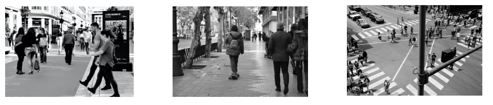
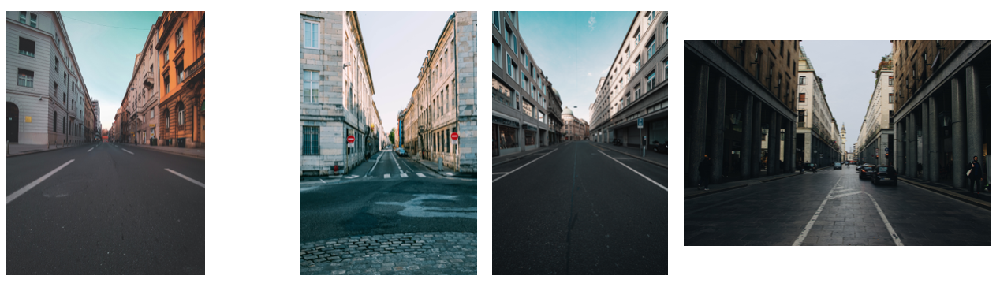
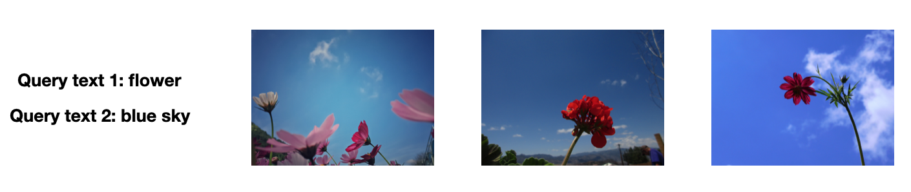
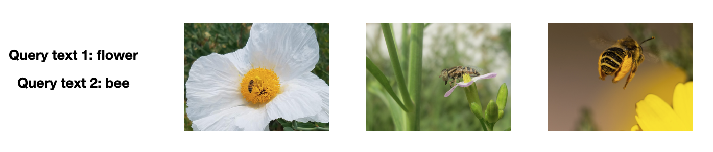
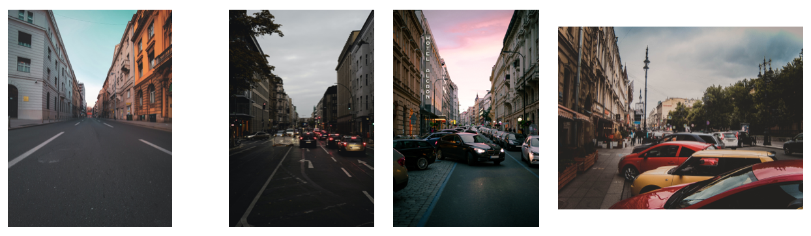
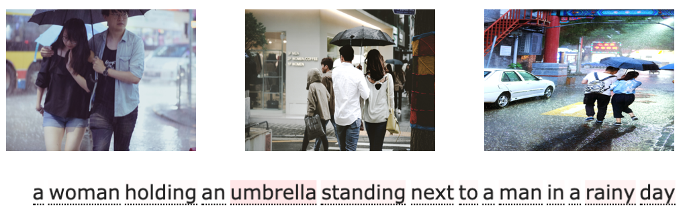
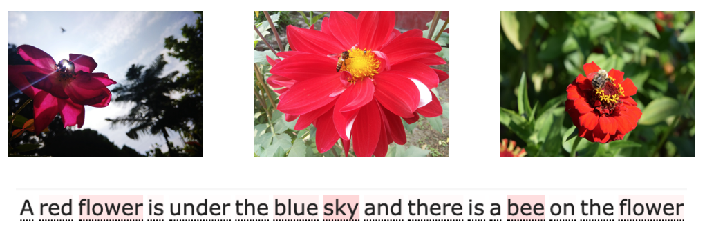

# natural-language-joint-query-search

In the project, we support multiple types of query search including text-image, image-image, text2-image, and text+image-image. In order to analyze the result of retrieved images, we also support visualization of text attention. The attention of image will be supported soon!

## Colab Demo

Search photos on Unsplash, support for joint image+text queries search.

[](https://colab.research.google.com/github/haofanwang/natural-language-joint-query-search/blob/main/colab/unsplash_image_search.ipynb)

Attention visualization of CLIP.

[](https://colab.research.google.com/github/haofanwang/natural-language-joint-query-search/blob/main/colab/clip_attention.ipynb)

## Usage

We follow the same environment as the [CLIP](https://github.com/openai/CLIP) project:

```bash
$ conda install --yes -c pytorch pytorch=1.7.1 torchvision cudatoolkit=11.0
$ pip install ftfy regex tqdm
```

To visualize the attention of CLIP, we slightly modify the code of CLIP as mention [here](https://github.com/openai/CLIP/issues/18), so you don't have to install CLIP via official command. An open-sourced visualization tool is used in our project, you need to clone it into this repo.

```bash
$ git clone https://github.com/shashwattrivedi/Attention_visualizer.git
```

Download the pre-extracted image [id](https://drive.google.com/uc?id=1FdmDEzBQCf3OxqY9SbU-jLfH_yZ6UPSj) and [features](https://drive.google.com/uc?id=1L7ulhn4VeN-2aOM-fYmljza_TQok-j9F) of Unsplash dataset, and put them under unsplash-dataset dir, details can be found in [natural-language-image-search](https://github.com/haltakov/natural-language-image-search) project.

```bash
$ mkdir unsplash-dataset

$ wget https://transfer.army/api/download/TuWWFTe2spg/EDm6KBjc -O unsplash-dataset/photo_ids.csv

$ wget https://transfer.army/api/download/LGXAaiNnMLA/AamL9PpU -O unsplash-dataset/features.npy
```

Example of joint query search.


```python
import torch
import numpy as np
import pandas as pd
from PIL import Image

from CLIP.clip import clip

def encode_search_query(search_query):
    with torch.no_grad():
        text_encoded, weight = model.encode_text(clip.tokenize(search_query).to(device))
        text_encoded /= text_encoded.norm(dim=-1, keepdim=True)
        return text_encoded.cpu().numpy()

def find_best_matches(text_features, photo_features, photo_ids, results_count):
  similarities = (photo_features @ text_features.T).squeeze(1)
  best_photo_idx = (-similarities).argsort()
  return [photo_ids[i] for i in best_photo_idx[:results_count]]

device = "cuda" if torch.cuda.is_available() else "cpu"
model, preprocess = clip.load("ViT-B/32", device=device)

photo_ids = pd.read_csv("unsplash-dataset/photo_ids.csv")
photo_ids = list(photo_ids['photo_id'])
photo_features = np.load("unsplash-dataset/features.npy")

# text to image
search_query = "Tokyo Tower at night."
text_features = model.encode_search_query(search_query)
best_photo_ids = find_best_matches(text_features, photo_features, photo_ids, 5)
for photo_id in best_photo_ids:
  print("https://unsplash.com/photos/{}/download".format(photo_id))

# image to image
source_image = "images/borna-hrzina-8IPrifbjo-0-unsplash.jpg"
with torch.no_grad():
  image_feature = model.encode_image(preprocess(Image.open(source_image)).unsqueeze(0).to(device))
  image_feature = (image_feature / image_feature.norm(dim=-1, keepdim=True)).cpu().numpy()
best_photo_ids = find_best_matches(image_feature, photo_features, photo_ids, 5)
for photo_id in best_photo_ids:
  print("https://unsplash.com/photos/{}/download".format(photo_id))

# text+text to image
search_query = "red flower"
search_query_extra = "blue sky"
text_features = encode_search_query(search_query)
text_features_extra = encode_search_query(search_query_extra)
mixed_features = text_features + text_features_extra
best_photo_ids = find_best_matches(mixed_features, photo_features, photo_ids, 5)
for photo_id in best_photo_ids:
  print("https://unsplash.com/photos/{}/download".format(photo_id))

# image+text to image
search_image = "images/borna-hrzina-8IPrifbjo-0-unsplash.jpg"
search_text = "cars"
with torch.no_grad():
  image_feature = model.encode_image(preprocess(Image.open(search_image)).unsqueeze(0).to(device))
  image_feature = (image_feature / image_feature.norm(dim=-1, keepdim=True)).cpu().numpy()
text_feature = encode_search_query(search_text)
modified_feature = image_feature + text_feature
best_photo_ids = find_best_matches(modified_feature, photo_features, photo_ids, 5)
for photo_id in best_photo_ids:
  print("https://unsplash.com/photos/{}/download".format(photo_id))
```

Example of CLIP attention visualization. You can know which keywords does CLIP use to retrieve the results. To be convenient, all punctuations are removed.

```python
import torch
import numpy as np
import pandas as pd
from PIL import Image

from CLIP.clip import clip
from CLIP.clip import model

from Attention_visualizer.attention_visualizer import *

def find_best_matches(text_features, photo_features, photo_ids, results_count):
  similarities = (photo_features @ text_features.T).squeeze(1)
  best_photo_idx = (-similarities).argsort()
  return [photo_ids[i] for i in best_photo_idx[:results_count]]

device = "cuda" if torch.cuda.is_available() else "cpu"
model, preprocess = clip.load("ViT-B/32", device=device, jit=False)

photo_ids = pd.read_csv("unsplash-dataset/photo_ids.csv")
photo_ids = list(photo_ids['photo_id'])
photo_features = np.load("unsplash-dataset/features.npy")

search_query = "A red flower is under the blue sky and there is a bee on the flower"

with torch.no_grad():
    text_token = clip.tokenize(search_query).to(device)
    text_encoded, weight = model.encode_text(text_token)
    text_encoded /= text_encoded.norm(dim=-1, keepdim=True)

text_features = text_encoded.cpu().numpy()
best_photo_ids = find_best_matches(text_features, photo_features, photo_ids, 5)

for photo_id in best_photo_ids:
  print("https://unsplash.com/photos/{}/download".format(photo_id))

sentence = search_query.split(" ")
attention_weights = list(weight[-1][0][1+len(sentence)].cpu().numpy())[:2+len(sentence)][1:][:-1]
attention_weights = [float(item) for item in attention_weights]
display_attention(sentence,attention_weights)
```

You can also run these example on Colab via [joint-query-search](https://colab.research.google.com/github/haofanwang/natural-language-joint-query-search/blob/main/colab/unsplash_image_search.ipynb) and [clip-attention](https://colab.research.google.com/github/haofanwang/natural-language-joint-query-search/blob/main/colab/clip_attention.ipynb).


## Example

### Text-to-Image

##### "Tokyo tower at night."


##### "People come and go on the street."


### Image-to-Image

##### A normal street view. (The left side is the source image)



### Text+Text-to-Image

##### "Flower" + "Blue sky"


##### "Flower" + "Bee"



### Image+Text-to-Image

##### A normal street view + "cars"


## Visualization

##### "A woman holding an umbrella standing next to a man in a rainy day"



"umbrella", "standing" and "rainy" receive the most of attention.

##### "A red flower is under the blue sky and there is a bee on the flower"



"flower", "sky" and "bee" receive the most of attention.

## Acknowledgements

Search photos on Unsplash using natural language descriptions. The search is powered by OpenAI's [CLIP model](https://github.com/openai/CLIP) and the [Unsplash Dataset](https://unsplash.com/data). This project is mostly based on [natural-language-image-search](https://github.com/haltakov/natural-language-image-search).

This project was inspired by these projects:

- [OpenAI's CLIP](https://github.com/openai/CLIP)
- [natural-language-image-search](https://github.com/haltakov/natural-language-image-search)
