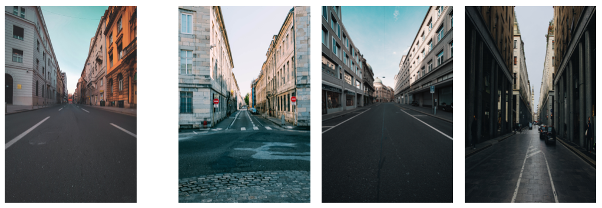
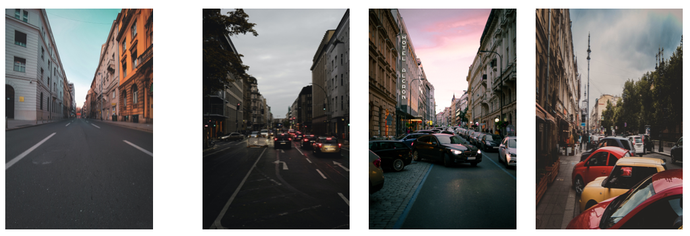

# natural-language-joint-query-search

In the project, we support multiple types query search including text-image, image-image, text2-image and text+image-image. In order to analyse the result of retrieved images, we also support visualization of CLIP attention.

## Colab Demo

Search photos on Unsplash, support for joint image+text queries search.

Attention visualization of CLIP.

## Example

### Text-to-Image

##### "Tokyo tower at night."

##### "People come and go on the street."

### Image-to-Image

##### A normal street view. (The left side is the source image)

### Text+Text-to-Image

##### "Flower" + "Blue sky"

##### "Flower" + "Bee"

### Image+Text-to-Image

##### A normal street view + "cars"

## Acknowledgements

Search photos on Unsplash using natural language descriptions. The search is powered by OpenAI's [CLIP model](https://github.com/openai/CLIP) and the [Unsplash Dataset](https://unsplash.com/data). This project is mostly based on [natural-language-image-search](https://github.com/haltakov/natural-language-image-search).

This project was inspired by these projects:

- [OpenAI's CLIP](https://github.com/openai/CLIP)
- [natural-language-image-search](https://github.com/haltakov/natural-language-image-search)
