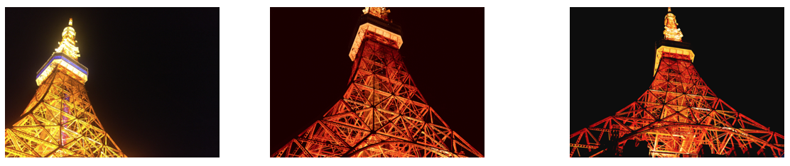
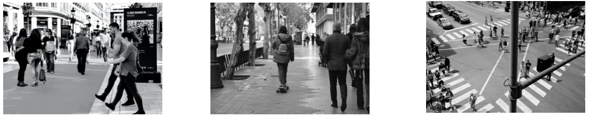

# natural-language-joint-query-search
Search photos on Unsplash, including text-to-image search, image-to-image search, text+text-to-image search and search with joint image+text queries.

Search photos on Unsplash using natural language descriptions. The search is powered by OpenAI's [CLIP model](https://github.com/openai/CLIP) and the [Unsplash Dataset](https://unsplash.com/data). This project is mostly based on [natural-language-image-search](https://github.com/haltakov/natural-language-image-search).

### Text-to-Image

### Image-to-Image

### Text+Text-to-Image

### Image+Text-to-Image

## Acknowledgements

This project was inspired by these projects:

- [OpenAI's CLIP](https://github.com/openai/CLIP)
- [natural-language-image-search](https://github.com/haltakov/natural-language-image-search)
